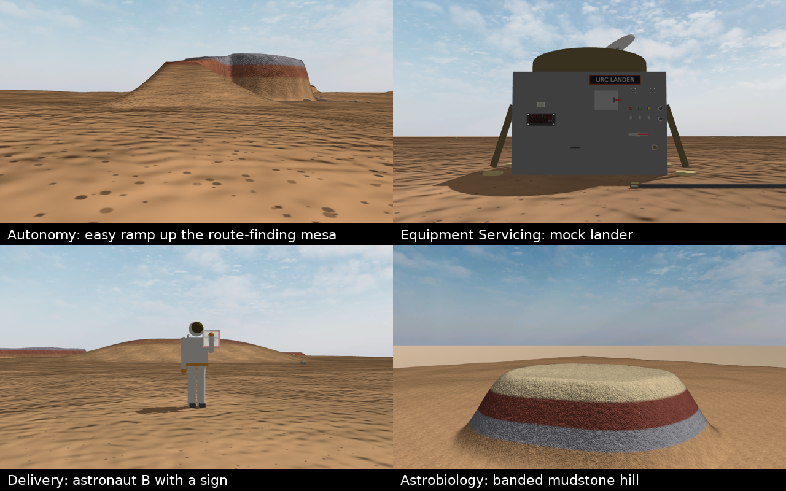

# Rover simulation (Gazebo Harmonic)

A generic model of our rover: rectangular chassis, rocker suspension with a
differential (4 wheels, a rocker-bogie without the bogies), tank / skid-steer
drive with a DC motor per wheel, an RGB-D camera on a pan-tilt head.
Geometry is the placeholder from `rover_control/include/rover_driver/config.hpp`
until the mechanical numbers arrive; the motor numbers are typical
placeholders until the drivetrain is chosen. Around it: the URC 2027 mission
worlds on MDRS ground (real lidar terrain for Autonomy, MDRS micro-relief,
ground types and clutter everywhere), a proving ground, a referee and a
browser driver station with Fly and Map views.

Design specs in `docs/superpowers/specs/`: `2026-10-05-gazebo-rover-model-design.md`
(the rover), `2026-10-06-urc-scenarios-design.md` (the URC worlds) and
`2026-10-06-urc-realism-design.md` (real ground, the physical drivetrain,
the pictures, the Fly and Map views; implemented 2026-10-07, its section 17
lists what changed on the way and which targets are met).

## Quick start

From the repository's root (`<workspace>/src`), after `pixi install`:

```bash
pixi run fetch-data             # the terrain rasters, once (git-ignored; --all for the research ones too)
pixi run sim                    # build the plugins (colcon), regenerate rover and worlds, open Gazebo (rover_test)
pixi run drive urc_autonomy     # or drive from the browser: starts the world headless, opens the station page
pixi run launcher               # every world as a tile: a click starts it with its station
pixi run sim-bridge             # second terminal: ROS 2 <-> Gazebo topics
pixi run ros2 topic pub -r 10 /cmd_vel geometry_msgs/msg/Twist '{linear: {x: 0.3}, angular: {z: 0.2}}'
pixi run test                   # the C++ tests and the simulation's suite (~15 min with the build)
pixi run sim-test               # the simulation's suite only
pixi run sim-maps               # orthophoto maps for the station's Map view (GPU, ~1 min)
pixi run sim-perf               # performance budgets (~25 min, wants an otherwise idle machine)
pixi run sim-slow               # the mission routes driven by the physical rover (~40 min)
pixi run sim-realism            # the realism report (rover_sim/data/research/realism_report.json)
```

Paths in this manual are relative to `rover_sim/` unless they start with a
top-level folder of the repository (`rover_sim/`, `rover_control/`, `docs/`).

`pixi run sim <world>` opens another world: a path to an `.sdf` or a name in
`rover_sim/worlds` (`rover_test`, `urc_autonomy`, `urc_equipment_servicing`,
`urc_delivery`, `urc_astrobiology`, `proving_ground`). The GUI camera starts on
the rover; with `--follow` it follows it, 5 m behind and 2.5 m up
(CameraTracking `/gui/follow`, then `/gui/follow/offset`).

The rover stops 0.5 s after its last command (the drivetrain's command
timeout), so publish `cmd_vel` at a rate, as the line above and the station
do. Gazebo GUI's Teleop plugin (⋮ menu → Teleop, topic
`/model/rover/cmd_vel`) sends one message per button press: in button mode
the rover moves for 0.5 s; use its keyboard mode, or build the rover with
`DriveParams(cmd_timeout=0)`, which holds the last command.

On macOS Gazebo cannot run its server and GUI in one process, so `rover_sim/run.sh`
starts the server in the background and the GUI in the foreground; closing
the GUI stops both.

## Files

| File | What it is |
|---|---|
| `gen_model.py` | Rover parameters (`Params`, `DriveParams`) and the SDF generator; it also writes the station cameras (`viewers.py`) |
| `viewers.py` | The station's cameras: `ChaseParams`, `EyeParams`, `FlyParams` and their models |
| `models/rover`, `models/chase_camera`, `models/eye_camera`, `models/fly_camera` | Generated by `gen_model.py`: edit the parameters, not these |
| `plugins/rover_drivetrain.cpp`, `.hh` | System `rover_sim::RoverDrivetrain`: motors, wheel contacts, dig-in and the tyre sink that shows it (it also feeds the ruts), odometry, and the dust when `DriveParams.dust` is on (see design notes) |
| `plugins/rover_tracks.hh`, `plugins/rover_tracks_render.hh` | The ruts and pits behind the wheels (`DriveParams.ruts`): the layer the drivetrain feeds (cross-sections, the pit rule, the ring, their geometry; no Gazebo includes) and its drawing on the rendering thread (`events::SceneUpdate`, camera sensors only) |
| `plugins/terrain_ground.hh`, `plugins/terrain_heightmap.hh` | The ground map reader (`ground.png`, `ground.json`) and the heightmap lookup the C++ systems share |
| `plugins/rocker_differential.cpp` | The differential (see design notes) |
| `plugins/joint_monitor.cpp` | Throttled joint/link state and key presses for the referee |
| `plugins/chase_camera.cpp` | System `rover_sim::ChaseCamera`: flies the chase camera above the ground, keeps the rover eye at the camera pivot |
| `plugins/fly_camera.cpp` | System `rover_sim::FlyCamera`: the Fly view's camera and the map tool's |
| `plugins/tests/` | C++ unit tests (`pixi run colcon-test`): motor, dig-in, contact rule, tyre sink, ground map, the ruts' layer and geometry |
| `worlds/rover_test.sdf` | Test ground: 10 cm step under the left wheels (x 2–3 m), 15° ramp to a 0.3 m platform (x 5–8.7 m), rocks |
| `bridge.yaml` | ROS 2 bridge topics |
| `run.sh`, `gzenv.py` | `pixi run sim`: server and GUI, camera on the rover; `gzenv.py` is the one place the Gazebo environment is set |
| `station/` | Driver station: `__main__.py` (CLI), `server.py` (web app), `link.py` (gz-transport), `drive.py` (keys → twist, deadman, the look, the fly camera), `video.py` (frames → JPEG), `minimap.py` (hillshade), `static/` (page) |
| `gen_worlds.py`, `urc/` | Generator of the URC worlds and the proving ground (see below) |
| `urc/terrains.py`, `urc/landscape.py` | The ground catalogue; ground rasters, micro-relief and clutter recipes |
| `urc/features.py`, `urc/world.py`, `urc/terrain.py` | Terrain features, `WorldBuilder`, heightfields |
| `urc/appearance.py`, `urc/farfield.py`, `urc/lighting.py` | Colour maps and NAIP de-shading, the far-field horizon, the mission sun and sky |
| `urc/media.py`, `urc/meshes.py`, `urc/textures.py`, `urc/props.py`, `urc/lander.py`, `urc/sdf.py` | Shared assets, procedural meshes and textures, models, the SDF writer every generated model uses |
| `urc/sheet.py`, `urc/dem.py`, `urc/routes.py`, `urc/realism.py` | Mission-sheet reader, GeoTIFF DEMs, route analysis, the realism measures |
| `urc/missions/` | One layout per world: `MISSIONS` (URC) and `COURSES` (test courses) |
| `urc/rules.py`, `urc/judge.py`, `urc/geo.py` | URC 2027 numbers with rule references, mission judges, WGS84 ↔ ENU |
| `worlds/urc_*`, `worlds/proving_ground.*`, `models/urc_*` | Generated, git-ignored, deterministic: worlds, mission sheets, maps, their models (each terrain's `albedo.png` for the ruts among them) and the shared `urc_media` |
| `referee.py` | Runs a URC mission against a live simulation |
| `tools/gz_media.py`, `patches/` | The patched gz-rendering media (terrain roughness, sky, haze), built into the workspace's `build/rover_sim` |
| `tools/render_map.py` | Orthophoto maps of the worlds (`pixi run sim-maps`) |
| `tools/realism_report.py` | The realism report (`pixi run sim-realism`) |
| `tools/make_relief_swatches.py`, `tools/terrain_targets.py` | Lidar relief swatches and the roughness targets (`data/relief`, `data/research/terrain_targets.json`) |
| `tools/fetch_data.py`, `data/rasters.json` | `pixi run fetch-data`: fetches the git-ignored rasters (their official sources, else the team's copy) and checks them against the manifest |
| `tools/fetch_dem.py`, `tools/link_data.sh` | Fetches a USGS 3DEP DEM for a new area; links the git-ignored rasters into a git worktree |
| `data/dem/`, `data/imagery/`, `data/soils/`, `data/relief/` | DEMs, imagery, the soil map, relief swatches; each `.tif` is git-ignored, its `.json` (tracked) says where it came from |
| `data/research/` | The research files the code reads or writes: the roughness targets, the lidar windows' measurements, the realism report and its contact sheet; the rest of the research is in `docs/research/` |
| `tests/` | `test_*.py` (see Performance for their run times); helpers `simulate.py` (headless runs, ground worlds, the pure-pursuit driver, CPU time per step) and `worldfiles.py` (sheets, terrain, world copies) |

## Topics

| ROS 2 (via `sim-bridge`) | Gazebo | Type |
|---|---|---|
| `/cmd_vel` → | `/model/rover/cmd_vel` | Twist (vx, wz); a command older than 0.5 s counts as zero (`DriveParams.cmd_timeout`, wall clock) |
| `/odom` | `/model/rover/odometry` | wheel odometry, `odom` → `base_link`, 50 Hz; no slip, so it over-reports a turn in place (2.65× on packed ground) |
| `/ground_truth/odom` | `/model/rover/ground_truth` | true pose, `world` → `base_link` (see Known limitations: an occasional yaw-rate spike) |
| `/drivetrain` | `/model/rover/drivetrain` | String, JSON at 50 Hz: per wheel setpoint, speed, current, torque, voltage, saturation, slip, load, ground, dig factor |
| `/joint_states` | `/model/rover/joint_states` | 2 rockers, 4 wheels, camera pan and tilt |
| `/imu` | `/model/rover/imu` | 100 Hz, frame `base_link` |
| `/gps/fix` | `/model/rover/navsat` | GNSS, 10 Hz, σ 0.5 m horizontal, 1 m vertical, WGS84 ellipsoidal heights |
| `/camera/{image,depth,points,camera_info}` | `/model/rover/camera/{image,depth_image,points,camera_info}` | RGB-D on the pan-tilt head, 1280×720, 1.5 rad, 15 Hz; RGB to 80 km, depth 0.1–40 m; frame `camera` |
| `/camera/pan` →, `/camera/tilt` → | `/model/rover/joint/camera_{pan,tilt}_joint/0/cmd_pos` | Float64 target angle [rad] |
| `/led` → | `/model/rover/led` | status LED: `red`, `blue`, `green` (flashing), `off` (URC rule 1.e.ii) |
| `/tf` | `/model/rover/tf` | `odom` → `base_link` |
| `/clock` | `/clock` | sim time |
| `/urc/score`, `/urc/radio` | same | referee: score JSON at 1 Hz; `los` / `nlos` to the C2 antenna |
| `/urc/display`, `/urc/launch_key` | same | Equipment Servicing: e-paper text, launch key |
| `/astronaut/command`, `/astronaut/speech` | same | Autonomy: the astronaut's commands |
| `/lander/joint_states` | `/model/lander/state` | the lander's joints (JointMonitor, 50 Hz) |
| – | `/model/rover/link/rocker_{left,right}/particle_emitter/dust_r{l,r}/cmd` | ParticleEmitter: the drivetrain sets the dust behind the rear wheels (10 Hz); only with `DriveParams.dust`, off by default (no dust, nothing on these topics) |

Joint names: `rocker_left_joint`, `rocker_right_joint`, `wheel_{fl,rl,fr,rr}_joint`,
`camera_pan_joint`, `camera_tilt_joint`. Rocker angle is positive when the
rocker's front goes down (rotation about +y); wheel angle is positive rolling
forward. The head's angles are from straight ahead and level: pan positive to
the left (±2.8 rad), tilt positive down (−0.6 rad up to +1.2 rad down, starting
at 0.12). `JointPositionController`s in velocity mode slew the head at 2 rad/s
to the angle last sent. `base_link` is the driver's body frame: x forward, y
left, z up, on the ground midway between the wheels.

The station's cameras have their own topics (Driver station, below).

## Changing the rover

Edit `Params` in `gen_model.py`, then `pixi run sim-model` (`sim`, `drive` and
`sim-test` do it for you). Masses, inertias, wheel positions, the
differential, tire friction, the sensors and the camera head all come from
there; `DriveParams` (`Params.drive`) holds every motor, controller, contact
and dust number of the drivetrain, each with its source or an (A) label for
an assumption; `ChaseParams`, `EyeParams` and `FlyParams` (`viewers.py`) set
the station's cameras.

`DriveParams.mode` picks the drivetrain: `"physical"` (the default,
`plugins/rover_drivetrain.cpp`) or `"diffdrive"` (Gazebo's DiffDrive, every
wheel a velocity servo on anisotropic tyres), kept as the A/B and cost
reference; in tests `simulate.diffdrive()`. The two must never be in one
model: DiffDrive's velocity servo overrides the torque. Both rovers carry the
same camera. `DriveParams.dust` (off: the user's decision of 2026-10-07, see
design notes) gives both an emitter behind each rear wheel, which the
physical drivetrain feeds. `Params.tire_compliance` (off) adds sprung
radial and axial hubs (design spec 6.7; revisit when the wheel type is
known). Three switches, all on, show the dig-in (the user's decisions of
2026-10-07, design notes, Visible dig-in): `DriveParams.dig_sink` draws a
dug wheel's tyre sunk at true scale, `DriveParams.ruts` (its numbers in
`TrackParams`) lays ruts and pits behind the wheels on soft ground, and
`Params.tread_tyre` draws the tyres with tread bars and spokes, one ochre,
from `models/rover/meshes/wheel.glb`. All three are visual only; off, each
takes away only its own cue, and with all three off the model is the one
before them, byte for byte.

## Driver station

```bash
pixi run drive urc_autonomy          # starts the world headless if nothing runs, opens the page
pixi run sim urc_autonomy --follow   # or: the Gazebo GUI, its camera following the rover...
pixi run drive                       # ...and the station attached to it (second terminal)
```

`pixi run drive [world] [--no-browser] [--port N] [--host H] [--world-name NAME] [--released]`:
- `world`: a path to an `.sdf` or a name in `rover_sim/worlds`. With a world and
  nothing running, the station starts `gz sim -s -r <world>` with `run.sh`'s
  environment, stops it on exit and exits when it exits. A world that fails
  to load ends the wait at once ("gz sim exited (code N) before <world> came up").
- Without `world` it attaches to the running simulation (it finds
  `/world/<name>/clock` on the transport); `--world-name` picks one.
- It spawns its two driving cameras (`model://eye_camera`,
  `model://chase_camera`, via `/world/<w>/create`) unless they are already in
  the world, and the fly camera (`model://fly_camera`) when Fly or Map is
  first used.
- `--port`: default 8765; without it, a port in use moves it to the next, up to 8774. The URL is printed.
- `--released`: start handed over to the autonomy stack.
- At start it prints whether the world's photo map is current, out of date or
  missing, with the `pixi run sim-maps` command.

One page, one keyboard focus: driving and the cameras use the same keys.
Click the page to drive; the rover holds still while the page lacks focus.

| Keys | Action |
|---|---|
| W / S | forward / back (hold) |
| A / D | turn left / right (hold) |
| Shift | twice the preset (capped at 3 m/s, 1.5 rad/s) |
| 1 – 5 | speed preset 0.25 / 0.6 / 1.2 / 2 / 3 m/s (0.4 / 0.8 / 1.2 / 1.2 / 1.2 rad/s) |
| Space | stop now |
| ← → ↑ ↓ | eye and onboard views: look left, right, up, down (1 rad/s); chase view: orbit, raise, lower |
| mouse drag on the video | eye and onboard views: look around (the point under the pointer stays under it); chase view: orbit |
| C or double-click | centre the look (ahead, 0.12 rad down); in the chase view a double-click puts the camera back behind the rover |
| J L / I K | look left, right / up, down in any driving view |
| + − or mouse wheel | zoom the chase camera (also while it is the small view) |
| F / R | chase camera: follow the heading or hold a world direction / back behind the rover |
| V / P / M / H | next driving view (eye, chase, onboard, depth) / show or hide the small view / zoom of the side map / help |
| B / G | Fly view / Map view; the same key again returns to the driving view |
| Gamepad | left stick drive (in every view); right stick looks, orbits or turns the fly camera in the big view; D-pad looks; LB/RB zoom; RT fast; B stop; X next view; Y follow or hold |

In the Fly view:

| Keys | Action |
|---|---|
| W / S / A / D, E / Q | forward, back, left, right; up, down |
| Shift | four times as fast |
| + − or wheel | speed multiplier ×0.25 to ×4 |
| arrows, I J K L, drag | look around |
| double-click | fly to that spot (stops 15 m short; looking straight down it moves over it) |
| R / F | back behind the rover (6 m behind, 3 m up) / follow the rover, keeping the offset, or stay |
| T / C | look straight down / look level |
| O | orthographic or perspective (orthographic views have no cast shadows) |
| Space | stop |

In the Map view: drag or arrows move the map, the wheel (about the pointer)
or + − zoom, C centres on the rover; a click flies the fly camera to look at
that point (straight down: it moves over it; orthographic: it keeps its
height, so its scale), a double-click opens the Fly view straight down there,
as wide as the map was.

Views: **Rover eye** (the default), **Chase camera**, **Onboard camera** and
**Onboard depth** (the RGB-D sensor's pictures) are the driving views; V
cycles them. **Fly** and **Map** are inspection views only a simulation has,
marked "Sim only" (at URC the operators see only what the rover sends). In
Fly and Map the keyboard flies or moves the map and never drives: the rover
slows to a stop and holds, the deadman stays satisfied, the LED stays blue
and the status reads "Inspecting: the rover holds still" (or "only the
gamepad drives": a gamepad's left stick, RT and B still drive). Released to
autonomy, the operator can still fly and watch. The small view shows the
chase camera, or the eye while the chase camera, Fly or Map is big; click it
to swap. Both show the whole picture, letterboxed.

The page shows the main and the small view; where the eye looks ("Rover eye,
32° left, 12° down"; the onboard views show the measured head angles); speed
and turn rate, measured against what you command ("got N %" of the turn);
heading, pitch, roll and height; a side view of the rover with both rocker
angles, the differential error (left + right, which the differential keeps at
0) and 30 s of rocker history; the four wheels' ground speeds and the head
angles; GNSS position; sim time and real-time factor; the LED; the referee's
score and radio line of sight while `pixi run referee` runs; the drivetrain;
and a map.

- **Drivetrain** (from `/model/rover/drivetrain` at 10 Hz): in the drive bar
  each wheel's motor current against the 20 A limit (red when saturated, an
  ochre ring when the wheel has dug in, dig > 1.05); in the side rail the turn
  asked (the drivetrain's applied command, so autonomy's too) and got (from
  ground truth), their ratio, 30 s of both, and per wheel the current, torque,
  slip, dig factor and ground. A DiffDrive rover shows only the turn rows, and
  released to autonomy no turn asked (the station sends none, and DiffDrive
  does not report autonomy's); the drive bar's "You ask" reads – then.
  The turn rate is computed from successive ground-truth yaws (Known
  limitations).
- **Map**: the world's orthophoto (`pixi run sim-maps`, served at
  `/map.jpg`; marked "Photo, out of date" when an input changed) or the
  hillshade of the sheet's heightmap (`/minimap.png`, tinted on one scale for
  every world: 0/8/30/90 m above the lowest point). On it: the places, the
  rover and its track (points 0.3 m apart, its last 1.2 km, started anew when
  the world is reset or restarts), the fly camera and the ground its picture
  covers; a scale bar. The side map zooms (M) to 250 / 60 m around the rover; a click
  on it opens the Map view. Worlds without a sheet get a grid.

How it works:
- `server.py` (aiohttp) and `link.py` (gz-transport). The page sends the held
  keys and stick axes over a WebSocket at 20 Hz, camera moves as small deltas;
  telemetry comes back at 10 Hz.
- `drive.py` turns inputs into a twist under acceleration limits: 1.0 m/s² and
  2.0 rad/s² speeding up, 2.0 m/s² and 4.0 rad/s² slowing down.
- While the station has control it publishes `/model/rover/cmd_vel` at 20 Hz
  and `blue` on `/model/rover/led` at 2 Hz (rule 1.e.ii: teleoperation).
- Deadman: if the page stops sending for 0.5 s (tab closed, focus lost,
  network gone) the twist is zero. Pressing Cmd lets go of all held keys
  (macOS browsers send no keyup for keys released while Cmd is down).
- "Release to autonomy" sends one zero twist, then stops the station's
  cmd_vel, LED and head messages so the team's stack can drive; "Take control"
  takes them back, at the same speed preset.
- Cameras are MJPEG streams (`/stream/<eye|chase|fly|rgb|depth>`; one JPEG at
  `/frame/<camera>`). A camera is subscribed, and so rendered, only while
  someone watches it; a hidden tab drops its streams. The first picture after
  subscribing is dropped (see Gazebo lessons). Depth is coloured on a log
  scale from 0.1 to 40 m; black means no return.
- The fly camera is controlled by topics only: the station publishes
  `/fly_camera/cmd` at 20 Hz while the page sends Fly input. A page that
  loses focus or hides lets go of its fly keys at once; one that vanishes
  (tab closed, network gone) leaves the station repeating the last command
  until its 0.5 s deadman, then the plugin's 0.3 s deadman (wall clock)
  stops the camera: within 0.8 s.
  Its spawn request blocks the station's event loop for up to 0.2 s the first
  time (the GIL lesson below); it is retried every 10 s while the camera does
  not report, and repeated after a world restart.
- Page messages with non-finite numbers (NaN, Infinity, 1e309) get an error
  reply; the camera plugins also drop non-finite commands.

Stopping and sharing:
- Ctrl-C, kill (SIGTERM) and closing the terminal (SIGHUP) stop the station the
  same way at any time: the rover gets a zero twist if the station was
  serving, and a world the station started gets SIGINT, then SIGKILL after
  10 s or at once on a second Ctrl-C. That world runs in its own session, so
  the terminal never reaches it. A signal ignored from the start (nohup) stays
  ignored. A SIGKILLed station stops the rover through the drivetrain's
  command timeout (0.5 s).
- One world per `GZ_PARTITION`, one station per world: the rover's topics are
  not world-scoped. Run separate worlds with `GZ_PARTITION=<name>`; the
  station warns when several share its partition.
- Stations announce themselves on `/driver_station/announce` (StringMsg, JSON
  `id`, `world`, `url`) at 2 Hz. A second station in the partition exits
  ("another driver station is attached to <world> (<url>)"); if two start
  within about a second, both pages say "Another driver station is attached".
  A station in control overrides autonomy's cmd_vel by design.
- When `/world/<w>/stats` stops for 3 s, telemetry blanks and the page says
  "Simulation not running: waiting for it"; when the world returns the station
  spawns its cameras again.
- A camera counts as present only while its plugin's state topic delivers
  (5-10 Hz of sim time); the plugins publish nothing while the world is
  paused, so the camera and drivetrain states count until sim time too has
  run on 1 s past them (a paused or slow world keeps them; on wall time alone
  a paused world lost its fly camera and drivetrain readout, and the station
  spawned the fly camera again and again). Nothing is spawned into a paused
  world. The console says per camera "spawned", "already in the world", "not
  spawned, the world has no /world/<w>/create (UserCommands system)", "spawn
  requested; the world is paused", or that its plugin does not report
  (the workspace's `build/rover_sim` missing from `GZ_SIM_SYSTEM_PLUGIN_PATH`).

**Rover eye** (`models/eye_camera`, `EyeParams`): 960×540 at 20 Hz with the
RGB-D sensor's 1.5 rad horizontal field of view. Near clip 0.1 m (it also
hides the camera's own housing, all within 0.1 m of the pivot), far clip
80 km, so it sees the far-field horizon (the depth sensor stops at 40 m).
The `ChaseCamera` plugin in eye mode (`<mount>` in the SDF) places it every
step at rover pose × `Params.camera_xyz` × Rz(yaw)·Ry(pitch): body-fixed, it
pitches and rolls with the chassis like the real camera; unsmoothed, one 1 ms
step behind the rover (measured at most 0.9 mm off the pivot while driving
over a 6 cm plank and turning; the test allows 1 cm). Looking only turns it,
within the head's limits. The look lives in the station (`drive.Look`, so a
page reload keeps it); every change goes to the eye at once
(`/eye_camera/look`) and, while the station has control, to the head, so the
onboard camera sees what you see. Released, the eye still turns but the head
belongs to the autonomy stack. The look is re-sent every second for cameras
spawned later.

**Chase camera** (`models/chase_camera`, `ChaseParams`): gravity off, no
collisions, an RGB camera (960×540, 20 Hz, 1.2 rad, far clip 80 km). Every
step the plugin puts it on a sphere around a point 0.5 m above the rover,
looking at it, and at least `ChaseParams.clearance` (0.5 m) above the visual
heightmap (measured within 1 cm where the plain sphere was over 1 m inside a
hill). Follow mode: yaw relative to the rover's heading (0 = behind); orbit
mode: yaw is a world direction. A 0.25 s first-order lag smooths it, so it
trails a turning rover by turn rate × 0.25 s. Pitch is clamped to 0.05–1.45
rad (never below the rover), distance to 1.5–80 m. It avoids the heightmap,
not rocks or objects. The heightmap is read on its first step: the world
stalls once, 20–100 ms at 1025–2049 samples, about 0.3 s on Autonomy's 4097.

**Fly camera** (`models/fly_camera`, `FlyParams`; `plugins/fly_camera.cpp`):
one link without gravity, collision or visual, carrying a 1280×720, 20 Hz,
1.2 rad RGB camera with clip 0.1–80,000 m. Each 1 ms step it integrates its
command: cruise speed = height above the ground × 1/s within 2–200 m/s, times
the multiplier (0.25–4); command components within ±4 (the fast key); a 0.2 s
velocity lag and a 0.08 s view lag. Its floor is ground + 1 m under the
camera and under the next 0.5 s of flight, and it is never below ground +
0.3 m (measured: 0.995 m minimum clearance at 16× cruise over a 30 m, 31°
hill). The ground is the visual heightmap and, beyond the terrain's edge,
the far field where that is higher (its `apron.json`): there the far DEM
rises up to 17 m above the edge within the 100 m the camera may go, and the
camera sat inside it. It stays within the terrain edge + 100 m and the
highest terrain + 2000 m. A goto (a map click, R, a double-click) flies a
smoothstep along the straight line, lifted over the ground under it (a line
through a hill once pinned it to the 0.3 m floor, sliding up the slope).
Orthographic projection is set from an `events::SceneUpdate` hook; its
window is 2 h tan(hfov/2), h the height above the ground where it began, so
switching does not jump and climbing zooms out; it looks straight down and
has no cast shadows. While orthographic the camera is drawn from 50 m above
the highest ground it may fly over, whatever its height (the state reports
its own): the near plane just under it cut away the terrain in its window
that rose above it. It starts at its spawn pose and returns there on a world
reset. The ground is read once from the visual heightmap when it is spawned
(18–95 ms, about 0.3 s at 4097²). An idle fly camera costs 1.5–3.5 % of the
step time, which is why the station spawns it only when first used.

| Gazebo topic | Type | |
|---|---|---|
| `/eye_camera/image` | Image | 960×540, 20 Hz |
| `/eye_camera/look` → | Vector3d | x: yaw = pan [rad] (left +), y: pitch = tilt [rad] (down +), absolute; clamped to the head's limits |
| `/eye_camera/state` | StringMsg | JSON at 5 Hz: mode `eye`, target, yaw, pitch |
| `/chase_camera/image` | Image | 960×540, 20 Hz |
| `/chase_camera/cmd` → | Vector3d | x: +yaw [rad], y: +pitch [rad], z: zoom (distance × eᶻ) |
| `/chase_camera/mode` → | StringMsg | `follow`, `orbit`, `reset` |
| `/chase_camera/state` | StringMsg | JSON at 5 Hz: mode, target, yaw, pitch, distance |
| `/fly_camera/image` | Image | 1280×720, 20 Hz |
| `/fly_camera/cmd` → | Twist | linear x, y, z = forward, left, up in cruise speeds (±4); angular.z yaw rate (left +), angular.y pitch rate (down +) [rad/s]; held 0.3 s |
| `/fly_camera/speed` → | Double | multiplier, 0.25–4 |
| `/fly_camera/look` → | Vector3d | x: +yaw, y: +pitch [rad], smoothed |
| `/fly_camera/goto` → | Pose | smoothstep over clamp(distance / 50 m/s, 0.4, 1.5) s; header data key `jump` makes it instant; it looks along the pose's x axis; a command or a look cancels it |
| `/fly_camera/mode` → | StringMsg | `free`, `follow`, `top`, `level`, `stop`, `ortho`, `ortho <width m>`, `perspective` |
| `/fly_camera/state` | StringMsg | JSON at 10 Hz of sim time: t, mode, x, y, z, yaw, pitch, agl, ground, speed, v, ortho (window width, 0 in perspective), goto |
| `/driver_station/announce` | StringMsg | JSON at 2 Hz: id, world, url |

WebSocket messages (page → station): `{t: "input", keys, axes}`,
`{t: "view", view}` (which view the page shows, so the station can spawn the
fly camera), `{t: "fly", keys, axes}` (held key codes and the right stick;
the key mapping is `drive.FLY_KEYS` / `drive.fly_command`), `{t: "fly_look",
yaw, pitch}`, `{t: "fly_speed", factor}`, `{t: "fly_mode", mode}`,
`{t: "fly_goto", kind: "rover" | "point" | "top" | "pixel", ...}`, and the
chase, look, preset and control messages. `/api/info` gives the map, the
cameras' fields of view, the fly camera's limits, the drivetrain's current
limit and the photo map's status.

## Design notes

In [design-notes.md](design-notes.md): why the differential is a plugin, not a mimic joint; the
drivetrain; visible dig-in; skid-steer friction.

## Known limitations

- The differential is a penalty spring (slightly soft, see above).
- The ground does not deform: sinkage is a static carve of the collision
  heightmap under each ground type (2 cm in sand, 3 cm in wash sand, 0.5 cm on
  regolith); dig-in raises resistance, not sinkage. The tyres are only drawn
  sunk (in every view, the Gazebo GUI too), and the ruts and pits only drawn
  (Visible dig-in), in camera sensors only, not the GUI; a rut's floor is a
  dark overlay, never lower than the terrain. Berms and rims are flat-shaded
  triangles of one colour per chunk and ground, untextured and casting no
  shadows: close up they read as faceted strips. Their colour is the colour
  map's, as Terra draws it from above; at eye level the cameras clip the
  sunlit sand's red (72–86 % of the sand pixels beside the berms at 255), so
  the darker berms show the colour map's redder hue and read pinker than the
  sand round them (Gazebo lessons). Tracks laid before a pit was dug keep
  their berms where they cross its sides. On relief, ruts far from the
  camera break into fragments: beyond Terra's finest level of detail the
  drawn surface leaves the heightmap by ±3 cm and buries the 4 mm floor
  (Gazebo lessons); on flat ground they stay whole at 400 m.
- The rover eye, the station's default main view, never sees a wheel digging
  in place (its head looks ahead): only the pits, once the rover backs out or
  turns; the tyre sink is about 3 px at the 5 m chase camera.
- DART's cylinder–heightmap collision lets wheels into rough relief beyond
  the carve: driving 10 m at 0.5 m/s the surface reaches into a wheel by
  1–17 mm (p99) on the worlds' natural ground (measured by the review,
  2026-10-07: the proving ground's badland strip 16.8 mm, Astrobiology's
  roughest 11.4 mm, Delivery 8.2 mm, Autonomy 5.6 mm, sand sheet 1.4 mm),
  2–3 cm on 5 cm RMS relief at any sample spacing; the same surface as a mesh
  0.5 mm. `test_urc_terrain` holds the badland strip under 2.5 cm (16.5 mm
  with its knobs faded whole).
- No stick-slip judder in slow turns on rock: a rigid rover turning in place
  slips at the yaw ratio where its slip is least, so the Stribeck drop has no
  first-order effect (design spec 6.9 target not met; tyre compliance gives
  a 22–24 Hz wheel hop instead). Revisit with the real wheels.
- Strong dig-in also stalls straight climbs in loose ground, by the user's
  choice (2026-10-07: the strong preset stays the default with them): sand at
  about 10–15° (the proving ground's 15° sand dune, 0.6 m up it), dusty clay
  at about 15° (Delivery's clay flank after 10 m; the proving ground's 12°
  clay slope it climbs at 0.39 m/s, its wheels dug in to 1.26).
- The rover high-centres on drops of 0.6 m and more (Delivery's 0.6 and 1.0 m
  ledges, the proving ground's), with either drivetrain.
- No camera noise: SDF `<noise>` on an RGB-D camera aborts gz on Metal.
- `/model/rover/ground_truth` (Gazebo's OdometryPublisher) occasionally
  reports a yaw rate off by 4π/dt for one message (−628 rad/s once in 25 s of
  spinning); its pose is right. The station differentiates the yaws; ROS
  consumers of `/ground_truth/odom` twist should too.
- The IMU sits at the chassis center but reports in `base_link`: orientation
  and angular rate are exact, linear acceleration differs by lever-arm terms.
- No TF for rockers and wheels in ROS (no URDF / `robot_state_publisher`).
- Sensors are GNSS, one RGB-D camera on a pan-tilt head and the IMU; no lidar.
  Cameras render only in worlds with the Sensors system (every generated world
  and `rover_test`).
- The RGB camera (1280×720 over 1.5 rad) decodes the 20 cm ArUco face square
  on at 5 m (measured; at 640×480 it read only to 2.5 m, and faces 30–60° off
  decoded only by luck from 3 m); farther and oblique reads were not measured.
- Equipment Servicing runs on Dantzig (per-wheel friction approximate), and
  the lander's parts skip collision with the heightmap (collide bitmask).
- One world per `GZ_PARTITION`: the rover's topics are not world-scoped.
- Gazebo prints `XML Element[gz_frame_id], child of element[sensor], not
  defined in SDF` on load. Harmless: `gz_frame_id` is a gz-sensors extension
  that sets a sensor's frame id; SDF has no standard element for it.

## URC 2027 mission worlds

One world per field mission of the [URC 2027 rules](https://urc.marssociety.org/home/requirements-guidelines)
(and the Q&A as of 2026-10-03), placed at the real coordinates near MDRS, plus
a proving ground for the rover.



*The worlds' orthophoto maps (`pixi run sim-maps`, 2026-10-07), rendered by
Gazebo from 300 m above the terrain.*

```bash
pixi run sim urc_autonomy          # or urc_equipment_servicing, urc_delivery, urc_astrobiology, proving_ground
pixi run referee autonomy          # second terminal: scripts the astronaut, judges, shows the LED
pixi run drive                     # or the driver station, attached to the running world
pixi run sim-bridge                # for ROS 2
pixi run sim-worlds                # regenerate (sim, drive and sim-test do it when an input changes)
```

| World | Rules | What is in it |
|---|---|---|
| `urc_autonomy` | 1.e | The Utah state square mile on the real USGS 0.5 m lidar DEM, draped with de-shaded NAIP 2024, its ground from the NRCS soil map. Astronaut Assistance south-east of C2: astronaut at a GNSS point, Follow!/Stay!/Fetch!/Come!/Give!, rock pick hammer. Route-Finding north-west: start post (ArUco 0), Post 1 (ArUco 1) on a narrow butte whose rim is lined with boulders except where the judges' easy route climbs on, Post 2 (ArUco 2) behind it out of radio line of sight. Landing pad. Soft sand in the washes, north-face scree, gravel aprons, a clay flat; a stony plain, rubble, talus, boulders below the cliff, two rock gardens; 2985 shrubs from NAIP. |
| `urc_equipment_servicing` | 1.d | Mock lander 90 m from the gate: K552 keyboard (87 spring keys, 2 cm tags 1–4), e-paper display, drawer with a cache well, latched hinged panel, locks A/B with a tubular key (tags 5/6, 1 cm tags at the keyholes), fuel tank with hose and 1.5" cam-lock coupler, ¼-turn valve, buttons, switches, knobs. Sample stand with the sample tube and the cache container. A 12 × 14 m gravel apron in front of the lander (the fuel tank stands on it). The site is shale-pediment clay crust with patches of sand sheet, relatively flat (4 m roughness 1.8 cm); rocks, 40 boulders and a 0.18 m rock garden, all off the gate-to-lander approach. |
| `urc_delivery` | 1.c | ~900 m course, rougher with distance: toolbox + wrench → astronaut A; astronaut B's sign ("BRING: WATER JUG"); supply crate up a hill; a field sign with a search area for an instrument case; first-aid kit past a boulder field, over a ridge pass and down 0.3/0.6/1.0 m ledges to astronaut C behind the ridge (no radio); spectrometer lost in a wash. The ground of 1.c.ii: a soft sand flat, a gravel plain, a 15° dusty-clay flank on the crate hill (a straight climb digs in and stalls after 10 m), soft sand on the wash floor, a 25° scree chute up the steep mesa off-route, two stony areas (0.12 / 0.22 m rocks), the boulder field, badland belts with haystack knobs off the course. |
| `urc_astrobiology` | 1.b | Site within 0.5 km of C2 (boundary stakes at 480 m): banded mudstone hills, dry sandy wash, gypsum outcrop, biological soil crust, sandstone ledge, lichen boulders, shrubs. Sample sites are not marked. Soft sand along the wash, clay aprons below the hills, a 26.6° scree chute up hill 1; talus, two rock fields (0.15 / 0.25 m), the ledge's blocks, badland belts, slabs and risers. |
| `proving_ground` | – | A test course, not a mission: friction lanes, sand, clay, slickrock, side slopes, natural strips of sand sheet, badland and block field, rock gardens, an articulation track, washboard, steps, boulders (see below). |

URC publishes the Delivery course script shortly before the competition
(rule 1.c.i); this course uses every task type the rules list. Only Autonomy
stands on real terrain; the other worlds are synthetic layouts on MDRS's own
micro-relief, ground types and clutter. URC has not released its own DEM
(Q&A Autonomy 20).

### Autonomy: the real square mile

**Terrain source.** `data/dem/route_area_lidar_0p5m.tif`: USGS 3DEP lidar,
public domain. South of about 38.4163 N the 2018 UT_Southern_QL1 0.5 m DEM;
north of it a 0.5 m grid of the ground returns of the 2020
UT_StatewideSouth point clouds (9.4–9.6 ground returns/m²), feathered at the
seam (the two differ by 1 cm median on flat ground); NAVD88 metres; shifted
by (−0.89, +0.62) m east, north so it lines up with the 3DEP and NAIP
services' datum (PROJ's default NAD83(2011) → WGS84 is a null
transformation; measured by phase correlation, residual ≤ 0.16 m). The
provenance (tiles, processing, checks) is in its `.json` and the sheet's
`judges_only.terrain_source`. The world takes 2048 m around the square
mile's centre at 0.5 m (4097² samples, gate G1: no step-time cost against
2049², +0.6 s start-up). The 1 m 3DEP DEM (`route_area_3dep.tif`) stays as the
cross-check and the source of the other worlds' altitudes.

**Imagery and ground.** `data/imagery/route_area_naip2024.tif`: NAIP
2024-07-06, 0.6 m, 4 bands, public domain. It is resampled to the world and
de-shaded before draping (`appearance.ortho_colour_map`): a sun fitted to
NAIP (azimuth by least squares on slopes over 10°, elevation from the
acquisition date: 54.7°, 105.8°), luminance fitted per soil unit as ρ̄·(k +
cos i) and divided by (k + cos i)/(k + cos i_flat) (a C-correction), cast
shadows ray-marched and inpainted, the spots under 3D shrubs inpainted, then
boosted ×1.25 saturation, ×1.1 contrast in linear light. NAIP's shrubs are
dark spots with a local NDVI anomaly (15,084, 36 per hectare); 2,985 stand as
meshes where the rover works. The ground raster is the NRCS SSURGO soil map
(`data/soils`) painted by slope (`landscape.Soils`): sand sheet 47 %, clay
crust 21 %, silt flat 15 %, badland slope 12 %, rock 2.7 %, plus the
mission's zones.

**World frame and altitudes.** World x, y are metres east and north of the
terrain centre; z = 0 lies 3 cm below the terrain's lowest point (the
sinkage carve). All altitudes (the origin, every sheet `alt`, NavSat and the
world's `dem.tif`) are WGS84 (G2139) ellipsoidal heights: the NAVD88
elevations plus `dem.NAVD88_TO_WGS84` = −20.91 m (GEOID18 N = −20.11 m, plus
NAD83(2011) to WGS84(G2139) at epoch 2027.4, −0.79 m; NOAA VDatum,
2026-10-06; −20.89 to −20.94 m across every URC world's origin). One helper,
`world.site(lat, lon)`, gives every world its origin this way. C2 1379.86 m.

**Layout** (world metres; grades over a 4 m base):

| Place | World x, y | Notes |
|---|---|---|
| C2 station | 160, 120 | on a flat central rise; the terrain runs from 56 m below it to 30 m above |
| Rover start | 166, 126 | facing north |
| Route start post (ArUco 0) | 0, 500 | flat, 412 m from C2, in radio line of sight of the 3 m antenna |
| Landing pad | 10, 512 | 16 m from the start post |
| Post 1 (ArUco 1) | 190, 520 | on the crest of a narrow butte, 15 m above the start post, in radio line of sight |
| Post 2 (ArUco 2) | 200, 590 | flat, 71 m north of Post 1, out of radio line of sight behind the butte (rule 1.e.xvi) |
| Astronaut waits | 198, 38 | 90 m from C2; Astronaut Assistance is all on ground under 6° and in radio line of sight |
| Follow! end | 212, −6 | 46 m walk; the rock pick hammer lies 4.2 m beyond |
| Stay! destination | 220, −37 | 32 m beyond the follow end |

**Rule 1.e.xv in the physics** ("not every approach to the target is navigable"):
- Driving straight at Post 1 from 6–80 m out, the grade is 26–46° from 23 of
  24 compass bearings (`judges_only.approach_grades`); the last runs along
  the crest to where the easy route climbs on.
- The soil map's ground climbs 22° (sand sheet, badland slope) to 30° (clay
  crust); faces steeper than 30° are rock, which climbs 40°. So on the
  butte's rock faces the boulders, not the grade, stop the rover.
- A line of caprock boulders along the butte's rim (`routes.rim`: the ground
  reached from Post 1 on slopes up to 20°, widened along the narrow crest):
  606 boulders, one every 0.8 m, too tall to climb and too close to pass
  between. The only opening is where the easy route climbs onto the butte
  (`judges_only.rim.entry`).
- The judges' easy route (`routes.easy_route`, 16° search limit on a 2 m grid)
  is 236 m with a max grade of 17.2° over 4 m. Where it crosses ground
  steeper than 15° it runs on a 12 m wide rib of bare caprock
  (`autonomy.EASY_ROUTE_RIB`; like every zone it tints the NAIP drape, below):
  the soil map's ground there climbs 22°, and a turning rover slid off a
  narrower rib on 21° side slopes. A skid-steer rover barely turns on such
  ground (4 % of the commanded yaw rate on 25° slickrock): a driver should
  arc, not spin.
- Measured (`pixi run sim-slow`): pure pursuit along the easy route at 1 m/s
  with a 4 m look-ahead reaches Post 1 in 337 s of sim time (the design
  allows 6 min). Post 2 is
  reachable across the plain and the wash sand.

**Ground** (all shared building blocks: `features.Patch`/`Wash`, catalogue
types, `WorldBuilder.scatter`/`rock_garden`/`rock_field`/`clutter`). Washes
traced from the DEM's drainage carry soft sand on their floors (the north one
runs between the start, Post 1 and Post 2; the cliff wash 15–20 m out from
the butte's foot). Loose scree on the butte's north face where the straight
line from the start crosses it, gravel aprons beside the start and below the
cliff, a dusty clay flat beside the drive from C2, slickrock on the crest and
the rib. Zones only paint the ground: the terrain is the DEM. The mission
puts them where its course needs them, not where NAIP shows that ground, so
each zone's palette covers 0.6 of the drape inside it (`appearance.tint_zones`,
NAIP's own light and shade kept, edges feathered over 1 m): the clay flat
reads grey (CIE76 14 against the sand sheet round it; 1 untinted); zones whose
palette is near the drape's colour change it little (gravel, scree, caprock
2–3).

| Rock group | Rocks (colliding) | Where |
|---|---|---|
| `stony_plain` | 1100 (634) | 0.04–0.4 m on the plain between C2 and the start, and round the knoll by the astronaut |
| `rubble` | 110 | 0.1–0.45 m on the straight line from C2 to the start post |
| `talus` | 250 | 0.15–0.7 m on the butte's faces |
| `boulders` | 112 | 0.4–1.2 m along the foot of the butte's cliff and below the knoll |
| `rock_garden_0` | 198 | 28 × 12 m of 0.2 m rocks between the start and Post 2: crossable |
| `rock_garden_1` | 78 | 20 × 10 m of 0.3 m rocks beside the drive from C2: they stop the rover, go round |
| `rim_boulders` | 606 | the butte's rim |
| `gravel` | 1859 (1103) | 0.15–0.3 m recipe gravel within 12 m of the drives |

Plus 98 recipe slabs under 1 m (larger blocks are in the DEM) and 20,000
pebbles round the start and the targets. Rock centres keep 6 m from the easy
route, the astronaut's walk and every target.

### Ground catalogue and the ground map

`urc/terrains.py` is the one catalogue of ground (`TYPES`); every world picks
from it by name, and each type carries four groups:
- **Traction** (design spec 5.6): what a wheel feels. μ is the Coulomb limit
  of the gross tyre force; rolling resistance and bulldozing are separate hub
  forces, so the net traction on the flat is μk − Crr and a rover climbs up
  to atan(μk − Crr) and, parked, holds to atan(μs). Values: Bekker for our
  wheel with a small-wheel derating where soils have Bekker numbers (sand,
  sandy loam), car-tyre rolling-resistance tables for the firm grounds,
  (A) elsewhere; each row of `terrains.py` cites its source.
- **Appearance**: a palette (hue and chroma from the soil survey's Munsell
  colour, lightness and spread from NAIP), a detail texture and a dust factor
  (it scales the rover's dust when `DriveParams.dust` turns it on).
- **Relief**: which lidar swatch, at what amplitude, plus haystack knobs and
  rills on badland (design 5.4).
- **Clutter**: slabs, rocks (by Golombek k), shrubs and risers per hectare.

| Key | Title | μs | μk | Crr | Bulldoze | Climbs | Holds | Slip | Sinkage | Dig-in (rate, D_max) | Spin, fresh (dug in) | Dust |
|---|---|---|---|---|---|---|---|---|---|---|---|---|
| `regolith` | Packed regolith (the default) | 0.62 | 0.52 | 0.1 | 0 | 22.8° | 31.8° | 0.3 | 0.5 cm | — | 0.377 | 0.4 |
| `sand` | Soft sand | 0.52 | 0.52 | 0.2 | 0.06 | 17.7° | 27.5° | 1 | 2 cm | 0.05, 2 | 0.261 (0) | 0.8 |
| `wash_sand` | Wash sand | 0.52 | 0.52 | 0.25 | 0.1 | 15.1° | 27.5° | 1.2 | 3 cm | 0.05, 2 | 0.182 (0) | 0.6 |
| `sand_sheet` | Crusted sand sheet | 0.6 | 0.55 | 0.15 | 0.03 | 21.8° | 31.0° | 0.6 | 1.5 cm | 0.005, 1.25 | 0.328 (0.291) | 0.6 |
| `clay` | Dusty bentonite clay | 0.45 | 0.45 | 0.15 | 0.06 | 16.7° | 24.2° | 0.5 | 2 cm | 0.05, 2 | 0.273 (0) | 1 |
| `clay_crust` | Shale pediment crust | 0.78 | 0.65 | 0.08 | 0 | 29.7° | 38.0° | 0.1 | 0 | — | 0.401 | 0.5 |
| `silt_flat` | Silt flat | 0.74 | 0.62 | 0.06 | 0 | 29.2° | 36.5° | 0.1 | 0 | — | 0.409 | 0.9 |
| `badland_slope`, `mudstone`, `bentonite` | Badland slope (popcorn crust), maroon and grey mudstone | 0.6 | 0.5 | 0.1 | 0 | 21.8° | 31.0° | 0.3 | 1 cm | — | 0.375 | 0.7 |
| `gravel` | Gravel | 0.62 | 0.52 | 0.05 | 0 | 25.2° | 31.8° | 0.3 | 0.5 cm | — | 0.410 | 0.3 |
| `fan_pavement`, `pavement` | Fan gravel pavement, desert pavement | 0.75 | 0.62 | 0.03 | 0 | 30.5° | 36.9° | 0.1 | 0 | — | 0.425 | 0.3 |
| `scree`, `block_field` | Loose scree; block field | 0.46 | 0.4 | 0.06 | 0 | 18.8° | 24.7° | 0.4 | 0 | — | 0.392 | 0.4 |
| `rock`, `slickrock`, `caprock` | Rock face, slickrock, sandstone caprock (and every rock, slab, riser, step) | 1 | 0.85 | 0.015 | 0 | 39.9° | 45.0° | 0.05 | 0 | — | 0.436 | 0.1 |
| `biocrust` | Biological soil crust | 0.62 | 0.52 | 0.12 | 0 | 21.8° | 31.8° | 0.3 | 0.5 cm | — | 0.364 | 0.2 |
| `gypsum` | Gypsum crust | 0.72 | 0.6 | 0.06 | 0 | 28.4° | 35.8° | 0.1 | 0 | — | 0.408 | 0.6 |
| `manmade` | Objects whose SDF sets no friction (pads, C2, lander) | 0.8 | 0.7 | 0.015 | 0 | 34.4° | 38.7° | 0.05 | 0 | — | 0.434 | 0 |
| `calibration_surface(mu)` | Test surface μ x (proving-ground lanes) | μ | μ | 0 | 0 | atan μ | atan μ | 0 | 0 | — | 0.441 | 0 |

Slip is the force-dependent slip parameter (slip ratio = slip × F/N in
steady driving: 20 % in sand at 0.5 m/s). "Spin" is the closed-form
turn-in-place ratio, fresh and at D_max. The dig-in column is the default
strong preset; `terrains.MILD_DIG` holds the mild values (sand 0.01, 1.25;
wash sand 0.012, 1.15; clay 0.008, 1.25). `ROCKS` holds the rock palettes,
`SHRUBS` and `PEBBLE_COLOURS` the shrub and pebble colours.

**The ground map.** Every world writes `ground.png` (one type index per
heightmap sample, 8-bit, row 0 north) and `ground.json` (legend, the traction
table under the current preset, the collision map naming every terrain
collision's ground, prefixes for merged clutter, defaults) next to its
heightmap (design spec 9.1). Rules paint it in order (`landscape.paint`:
`Base`, `Noise`, `Along`, `Hills`, `Steeper`, `Band`, `Below`, `Soils`), then
the mission's zones (`features.Patch`, `Wash`, `Slope`, `Lane` surfaces). It
is the one record of what ground is where: the drivetrain reads it at every
wheel contact, the colour map, relief and clutter follow it, the station and
the sheet show it. `urc.sheet.ground(sheet, path)` reads it in Python with
the same nearest-sample rounding as the C++ lookup. Zones only paint: nothing
in a world carries a friction coefficient of its own.

**Sinkage.** The collision heightmap is the visual one carved by each type's
static sinkage (eased in over 0.75 m inside the type), so wheels sit 2–3 cm
into sand on screen; world z = 0 lies 3 cm (the largest sinkage) below the
lowest point, and each PNG is scaled to its own maximum with its own `<size>`
z. Objects stand on the carved ground (`WorldBuilder.ground`).

### Real terrain and looks

- **Relief** (`world.add_relief`, design 5.4): synthetic worlds add, under
  each ground type, high-pass residuals of the real 0.5 m lidar ("relief
  swatches", `data/relief`, `pixi run sim-relief`: sand sheet, shale
  pediment, badland, block field, slickrock windows) in 64 m blocks, rotated
  or mirrored and blended so overlaps keep their RMS, plus haystack knobs and
  downhill rills on badland. It is kept off engineered ground: a mission's
  `RELIEF` lists pads, graded ways and features (`landscape.keep_flat`; within
  2 cm of the designed shape). Wash channels stay smooth (flash floods; their
  banks stay crossable). Haystack knobs lie where their belt's mask is over
  0.5, each faded whole by it (cut by a mask that fell over 2 m they made 3 m
  walls of 60°). Autonomy's relief is the lidar's own.
- **Roughness against MDRS** (plane-detrended RMS height in 4, 8, 16 m
  windows, `data/research/terrain_targets.json` from both lidar squares):
  every ground type's median lies within the real p25–p75; the natural ground
  of Delivery and Astrobiology within 30 % of the real square's p50 and p90
  (the realism report has the numbers). Equipment Servicing is the rule's
  "relatively flat" site: 4 m p50 1.8 cm.
- **Clutter** (`WorldBuilder.clutter`, `slabs`, `risers`, `rock_field`,
  `shrubs`, `imaged_shrubs`, `pebbles`): tabular sandstone slabs by the
  measured size-frequency of MDRS block fields (1–7 m: N(≥1) 1.69, N(≥2)
  0.81, N(≥4) 0.14 per 100 m², 8.3 % cover, against the table's 1.67, 0.74,
  0.17 and 8.6 %) and badland edges, tilted up to 30° but no further than
  keeps their top out of the ground at the buried edge
  (`world.slab_tilt`); risers along benches, their top falling back into the
  ground behind the face (at most 15°: a step up from below, never a wall);
  gravel within a corridor of the course; shrubs at each type's density, and
  the tall wash-margin shrubs (0.5–2.5 m, 480/ha) on every wash's banks
  (`features.Wash.margin`); meshes near the course, dots in the colour map
  elsewhere; pebbles round the start and the targets, at most 20,000 per
  world. All merged per 128 m chunk and kind into the terrain's link: rocks,
  slabs and risers collide (OBJ; rock by `ground.json`'s prefixes), shrubs and
  pebbles are visual only and stand on the drawn (uncarved) ground; visuals
  are glTF with one primitive per colour. 1.0–1.9 M triangles per world.
- **Colour** (design D11): Terra's layer 0 is a 4096² colour map over the
  terrain with a flat normal map. Synthetic worlds bake it from the ground
  raster (`appearance.colour_map`: palettes mottled over their p10–p90,
  badland strata on a dipping elevation ramp, slope and cavity shading, far
  shrubs as dots); Autonomy drapes de-shaded NAIP, its zones tinted in. Over
  it three shared detail layers (gravel lag 0.35, cracked silt 0.15, slab
  joints above a cap height; Autonomy has none of the last: its highest
  ground is sand-sheet plain, not the butte's caps) with near-constant
  weights; layer 0 is compensated per texel in linear light so the render
  shows the map plus zero-mean detail. The
  rendered maps match their colour maps to a median CIE76 of 2.1–2.4
  (smoothed over 2 m; the realism report).
- **Far field** (`urc/farfield.py`): a visual-only GLB per world, 60 × 80 km
  from the 3DEP 60 km DEM on a 120 m grid with Earth curvature, textured by the
  NAIP 2021 overview brought to NAIP 2024's colour (per-channel gains measured
  over the Autonomy square; it was 17 % darker than the drape beside it) and
  boosted alike, a hole under the terrain and every vertex within a grid step
  of it sunk 4 m under the lowest terrain near it, Autonomy's lidar too (its
  edge triangles showed through by up to 19 m): the Henry Mountains and
  Factory Butte stand on the horizon where they are. `apron.json` beside the
  mesh holds its heights round the terrain for the fly camera. Cameras need clip far 80 km to see it (eye, chase, fly and the
  rover's RGB have it).
- **Light** (`urc/lighting.py`): the sun of the mission date, 2027-05-28 10:30
  MDT at MDRS (NOAA's algorithm: elevation 49.9°, azimuth 102.4°), colour
  (1.0, 0.95, 0.87), intensity 1.9 (so sunlit flat ground renders at its
  colour map), ambient (0.32, 0.34, 0.40).
- **Media patch** (`pixi run sim-media`, run by `sim-build`; `tools/gz_media.py`,
  `patches/gz-rendering8-ogre2-media.diff`): a copy of the env's gz-rendering
  media in `build/rover_sim/gz-rendering-media` (in the workspace) with Terra's roughness fixed (stock
  Terra renders a layer without a roughness map as a mirror: glints and dark
  sky "puddles"), a procedural clear sky with the mission sun's disk, and
  distance haze (β 4e-5 /m, at most 0.85; colour only, never depth). The sun,
  sky and haze come from `lighting.py`. Soft: if the diff does not apply it
  warns, leaves nothing behind and Gazebo uses its stock media; `gzenv` sets
  `GZ_RENDERING_RESOURCE_PATH` only once the copy is complete. The GLSL half
  was written for Linux and never run (Metal only).

### Building blocks

Every world is built from shared, parameterised parts. A world module only
says where and how much; it has no scattering, painting or terrain-shaping
loops of its own.

- **Terrain features** (`urc/features.py`): frozen dataclasses.
  `features.shape(hf, FEATURES)` edits the heightfield in `make_terrain()`;
  `features.dress(w, FEATURES)` adds zones and blocks right after
  `w.terrain()`. Each feature says what to keep flat (`keep_flat()`) and what
  ground it paints (`footprints()`).
  - `Patch` (a natural zone) and `along` (patches along a path).
  - `Wash`: a channel `depth` deep (0 on a real DEM) with banks of at most
    `WASH_BANK` = 15° and sand on its floor.
  - `Mesa`; `Slope` (a planar chute with its zone, e.g. scree).
  - `Lane` + `Surface`: a graded strip (profile [(length, grade)], optional
    side tilt) with zones side by side; `Natural`: a strip of a catalogue
    type with its own relief and clutter.
  - `Washboard` (corrugations; the wheels ride a collision mesh of the same
    surface, `WorldBuilder.surface_mesh`), `AlternatingBumps`, `TwistDitch`, `Step`.
  - `Ledge`: a vertical drop with a lip; boxes in the terrain link cover the
    heightfield's slope down the step.
- **Ground** (`urc/landscape.py`): paint rules and the soil map (above);
  `relief()`, `keep_flat()`, `only()`; `place()` turns clutter recipes into
  placements; `window_rms()` is the roughness every target uses.
- **Heightfields** (`urc/terrain.py`): `Heightfield` ops `noise`, `flatten`,
  `mesa`, `ramp`, `channel`, `ridge`, `level`, `strip`, `bump`, `washboard`,
  `detail`, `haystacks`, `rills`; queries `height`, `slope_deg`,
  `slope_map`, `line_of_sight`, `max_grade_along`.
- **`WorldBuilder`** (`urc/world.py`), in layout coordinates:
  - `WorldBuilder(key, title, rule, site(lat, lon), hf, models_dir,
    worlds_dir, media, seed, solver=...)`; `add_relief(hf, rules, ...)` before it.
  - `paint(rules)`, `terrain(...)` (colour map, or `orthophoto=` NAIP for a
    real-DEM world; `layers=` height bands for small test worlds), `zone`,
    `zone_rect`, `block`, `surface_mesh`.
  - Rocks: `scatter`, `scatter_each`, `keep_clear`, `rock_field`,
    `rock_garden`; clutter: `clutter`, `slabs`, `risers`, `shrubs`,
    `shrub_dots`, `imaged_shrubs`, `pebbles`, `near`.
  - Other parts: `ring` (boundary stakes), `station` (a field sign plus a
    sheet point), `c2`, `rover`, `place`, `include`, `mark`, `point`,
    `task`, `radio_los`, `to_world` / `to_layout`, `height`, `ground`, `geo`.
  - `write()` writes the heightmaps, `dem.tif`, `ground.png`/`.json`, the
    colour map (and `albedo.png`, its 1024² mean in linear light, for the
    ruts) and detail layers, the merged clutter, the far field, the
    world SDF and the sheet; terrain collisions get collide bitmask
    `sdf.GROUND`.
- **Shared assets** (`urc/media.py`, `Media`): textures, meshes and glTF in
  `models/urc_media`, each named `<stem>_<hash>.<ext>`. The hash covers the
  generator function, its arguments with their defaults, the source of its
  module and of every module of `urc` that module uses, and the contents of
  the files its arguments name (a re-fetched raster), so a file is made once
  and skipped while current (`media.texture`, `mesh`, `glb`,
  `detail`, `aruco`, `sign`, `quad`, `dust_puff`). A world's own model
  (`urc_terrain_<key>`) holds its heightmaps, `dem.tif`, ground map, colour
  map and merged clutter; `urc_farfield_<key>` its horizon.
- **Reading a world back** (`urc/sheet.py`), the one reader for the referee,
  judges, station map and tests: `path(world)`, `find(world, world_path)`,
  `load(path)`, `terrain(sheet, path, collision=False)`, `ground(sheet,
  path)`, `radio_los(hf, antenna, x, y, ground)`. Tests add
  `tests/worldfiles.py`.
- **Routes** (`urc/routes.py`): `easy_route` (slope-limited Dijkstra on a grid
  of the smoothed terrain), `approach_grades`, `rim`.
- **Realism** (`urc/realism.py`): roughness, slab size-frequency, shrub
  density, palette and NAIP colour differences, rendered maps against colour
  maps; `test_realism.py` checks them, `tools/realism_report.py` reports them.
- **SDF** (`urc/sdf.py`) writes every generated model: worlds, props, the
  rover and the station cameras.

New ground types go into `terrains.TYPES`, new rock colours into
`terrains.ROCKS`. A new reusable shape becomes a `features` dataclass or a
`Heightfield` op, not a loop in a world module.

### A new world

1. Add `rover_sim/urc/missions/<name>.py` with `KEY` and `build(models_dir, worlds_dir, media)`.
2. Register it in `MISSIONS` (URC missions) or `COURSES` (test courses) in `missions/__init__.py`.
3. Run `python rover_sim/gen_worlds.py <name>`.

```python
from .. import features, landscape, terrain, terrains
from ..world import WorldBuilder, add_relief, site

KEY = "demo"
FEATURES = [features.Mesa("butte", 30, 40, 12, 8, 10, seed=3),
            features.Wash("wash", [(-90, -20), (0, -30), (90, -40)], depth=1.5, sand_step=30),
            features.Patch("gravel", terrains.GRAVEL, -30, 20, 8),
            features.Ledge("ledge", -60, 40, 0.0, 0.5)]
PAINT = [landscape.Base("regolith"), landscape.Noise("sand_sheet", feature_m=60.0, cover=0.3),
         landscape.Steeper(20.0, "badland_slope")]
RELIEF = dict(features=FEATURES, pads=[(0.0, 0.0, 6.0)])  # kept flat: the features' own and the start


def build(models_dir, worlds_dir, media):
    hf = features.shape(terrain.Heightfield(256, 513).noise(0.5, 60, seed=1), FEATURES)
    hf = add_relief(hf, PAINT, seed=1, **RELIEF)  # each type's MDRS micro-relief
    w = WorldBuilder(KEY, "Demo", None, site(38.41, -110.79), hf, models_dir, worlds_dir, media,
                     seed=1, name=KEY, solver="pgs")
    w.paint(PAINT)
    w.terrain()                          # colour map, detail layers, far field
    features.dress(w, FEATURES)          # zones and blocks before anything stands on them
    w.rover(0, 0, 0)
    keep = w.keep_clear()
    w.rock_field("rocks", w.scatter(200, (0, 0), 100, (0.05, 0.4), avoid=keep))
    w.clutter(avoid=keep, rocks_within=w.near(spots=[(0.0, 0.0, 40.0)]))  # slabs, shrubs; gravel near the start
    return w.write()
```

(Built and checked with `gz sdf -k` on 2026-10-07: 8 zones, 3728 rocks (200 placed,
the rest recipe gravel), 17 slabs, 79 shrubs, in 9 s.)

### Generating

`pixi run sim-worlds` (or `python rover_sim/gen_worlds.py [world ...]`) writes
`worlds/urc_<mission>.{sdf,json}` and `worlds/proving_ground.{sdf,json}` and the
models they use, in about 65 s for all five (Autonomy 23 s, Astrobiology
20 s, Delivery 10 s, proving ground 6 s, Equipment Servicing 4 s). Generation is
deterministic; edit the layouts in `urc/missions/`, not the output. Its pixi
inputs are `gen_worlds.py`, `gen_model.py`, `urc/**/*.py`, the DEMs, the NAIP
rasters, the relief swatches, the soil map and the roughness targets.
- At the end of every run, `prune` removes the `urc_*` models and `urc_media`
  files that no `worlds/*.sdf` (or the models those use) references.
- Runs may overlap: each builds under a shared flock on
  `models/.gen_worlds.lock`, and prune takes it exclusively. Anything else that
  writes into `rover_sim/models` must hold `gen_worlds.lock(models_dir)`. Building
  the same world twice at once is not supported. Media writes each new file
  under a hidden per-process name and renames it when complete.
- Terrain model directories are 100–200 MB (mostly the uncompressed
  `dem.tif`), each far-field GLB about 20 MB.
- `pixi run sim-maps` (`tools/render_map.py [worlds] [--pixels 4096] [--force]
  [--check]`) renders `worlds/<world>_map.jpg` and `_map.json` with Gazebo:
  tiles shot straight down from 300 m above the highest terrain, each map
  pixel projected through its tile at its terrain height, seams cross-faded.
  A map is stale when any input changed (the world, every file it references,
  the media patch and the sun, sky and haze it is filled with; SHA1 in the
  `.json`); what only physics reads (collisions, their heightmaps and meshes,
  friction, the solver) is no input. Without arguments it renders the missing
  and stale ones. Tall things lean, as in any orthophoto.

### Proving ground

`pixi run sim proving_ground`. Not a URC mission: registered in
`missions.COURSES`, no tasks, no referee. The terrain is 256 m with 2049
samples (0.125 m), on flat ground near MDRS. The rover starts at the entrance
gate, world (30, −62), facing north up the central road. Every station has a
field sign by the road and a sheet point with title, description, heading and
profile.

West of the road (strips run west):
- **Friction lanes**: calibration surfaces μ 0.20 / 0.35 / 0.50 / 0.70 / 0.95
  from south to north, 5 m wide, side by side up one hill: 8 m flat, 8 m at
  10°, 4 m landing, 7 m at 20°, 4 m landing, 5 m at 30°; then a plateau 6.85 m
  up and a 12° way down. A rover holds or climbs to atan(μ).
- **Sand pit**: 10 m flat, then a 15° dune up and down. **Clay patch**: 10 m
  flat, then 12° up and down. With the strong dig-in the rover crosses the
  flat sand at 0.37 m/s of 0.5 commanded (its wheels dug in to 1.26) and
  stalls 0.6 m up the dune as its slipping wheels dig in to 2.0; it climbs
  the clay slope at 0.39 m/s (dig 1.26). **Slickrock slab**: 6 m flat, then
  25° up and down: crossed.
- **Side slopes** of 10° and 20°, each 20 m long.
- **Natural strips**, 40 m each, from the mission worlds' recipes: crusted
  sand sheet with its shrubs, a 12° badland slope with haystack knobs and
  rills, a block field of tabular slabs.

East of the road (stations run east):
- **Rock gardens**: 12 × 6 m plots of 0.1 / 0.2 / 0.3 / 0.4 m rocks, all colliding (the wheel radius is 0.15 m).
- **Articulation track**: humps of 10 / 20 / 30 cm (each 1 + 2h m long) under
  the left wheels, then the right, every 3 m; then a diagonal twist ditch,
  0.49 m deep at atan(track / wheelbase) = 41.6°.
- **Washboard**: 20 m, crests every 0.8 m, ±4 cm.
- **Steps**: up-steps and drop-offs of 0.1 / 0.2 / 0.3 m.
- **Boulder field**: 70 boulders of 0.3–1.0 m.

Measured with the physical rover: parked on the 20° ramp for 3 s, the μ 0.20
lane slides and μ 0.95 holds; at 0.5 m/s the 0.2 m rock garden is crossed;
the twist ditch turns the rockers to 0.496 of their 0.5 rad limit and the
rover drives on across; the washboard is crossed at about 0.45 m/s (on its
corrugated heightmap alone, before it got its collision mesh, the rover
stalled 1–4 m in, with either drivetrain).

### Mission sheets

`worlds/<world>.json` is the judges' hand-out plus ground truth:
- `origin` (WGS84 of the world origin), `points` and `objects` with world `x, y,
  z` and WGS84 `lat, lon, alt` (what the rover's GNSS reports), `tasks` with
  rule references, tolerances and points, `c2` with its antenna, `rover_start`,
  `time_limit_s`, `physics` (engine, step, solver), `light` (the sun).
- `terrain`: `heightmap` (16-bit PNG, centred on the world origin, row 0
  north, column 0 west, z = pixel / 65535 × `z_max`), `collision_heightmap`
  and `z_max_collision` (the carved surface), `dem_geotiff` (the visual
  surface as a GeoTIFF, so DEM tooling can be practised), `size_m`,
  `samples`, `ground_map`, `ground_legend`, `ground_share`, `colour_map`,
  `details`, `sources` (DEM, imagery, soil map or relief windows).
- `terrain_zones`: {key: type, title, center, area_m2, outline};
  `terrain_types`: {type: title, mu_s, mu_k, climb_deg, hold_deg, sinkage_m,
  notes}; `rocks`: {group: count, colliding}; `slabs` (with the size-frequency
  per type), `risers`, `shrubs`, `shrub_dots`, `shrub_density`, `pebbles`,
  `imaged_shrubs` (Autonomy), `clutter_triangles`.
- Per mission: `astronaut` (Autonomy), `lander` (Equipment Servicing),
  `site_radius_m` and `ground_truth_units` (Astrobiology).
- `judges_only`: what the judges would not hand out. Autonomy: `easy_route`
  (with `clearance_m`), `rim`, `approach_grades`, `washes`, `terrain_source`.
  Delivery: `ridge`, `ridge_pass`, `wash`, `steep_mesa`, `boulder_field`,
  `stony_ground`.

World frame: x east, y north, z up, origin at the **terrain centre, 3 cm
below its lowest point** (Gazebo needs the heightmap there, see Gazebo
lessons), so the C2 station is not at the origin. Layouts are written in
metres from C2 (a course's entrance); `WorldBuilder` converts. Every `alt` is
the origin's altitude plus z, a WGS84 ellipsoidal height.

### Referee

`pixi run referee <mission> [--method device|sign|speech|gesture] [--key word] [--seed N]`:

- **Autonomy**: moves the astronaut (`set_pose`) and gives each command by the
  chosen method: `device` → `/astronaut/command`, `speech` → `/astronaut/speech`
  (stands in for audio), `sign` raises the astronaut's sign (ArUco 10; the
  command order is fixed, Q&A Autonomy 13), `gesture` uses one gesture per
  command (beckon for Follow!/Come!, palm out for Stay!, point down for
  Fetch!, both arms out for Give!). Scores per rule 1.e (Follow! by method).
  The astronaut waits at the GNSS point until the rover arrives, so the
  sub-missions can come in either order; each later command times out after
  4 min. Stay! needs the rover with the astronaut and the astronaut > 20 m
  away; for Come! the astronaut first walks to 20 m; Fetch!/Give! need the
  hammer picked up after Fetch! and dropped by the astronaut. Route targets
  need the rover stopped within 1 m and the LED green.
- **Equipment Servicing**: draws a 3–6 letter launch key (printed and on
  `/urc/launch_key`), decodes key presses into the display text
  (`/urc/display`, backspace works), and judges the cache, drawer, panel,
  lock, hose, valve and controls from joint angles and part poses.
- **Delivery**: an object counts as delivered lying on the ground, at rest
  for 1 s, within 2 m of the astronaut; a quarter of the task for opening the
  toolbox or finding a stage-2 object (part of the task's share, not extra).
- **Astrobiology**: a site is a stop of ≥ 30 s, ≥ 20 m from other sites, C2
  and the start, within 0.5 km of C2; then back within 15 m of C2. The science
  is judged by people.

It also publishes `/urc/score` (JSON, 1 Hz) and `/urc/radio` (`los` / `nlos`
between the 3 m C2 antenna and a point 1 m above the ground under the rover,
sampled every 0.5 m along the line, the same test as the sheet's `radio_los`
flags), re-sends the launch key and display text every second, and draws the
LED: the rover's software publishes its state on `/led`, the referee colours
the LED on the rover's back. Where the rules give no points (Equipment
Servicing, Delivery), tasks share 100 points equally; the field judges decide
that at URC. Distances are from the rover's footprint; "stopped" is < 5 cm/s
for 2 s.

## Gazebo lessons

In [gazebo-lessons.md](gazebo-lessons.md): what gz-sim 8.10, gz-rendering 8.2.2, DART and ogre2 on
Metal taught us while building the worlds, the station and the realism work.

## Performance

Apple M4 (4 performance + 6 efficiency cores), 16 GB. Measured 2026-10-07
for this README on an otherwise idle machine unless noted.

**Physics** (`pixi run sim-perf`, `test_perf.py`): plain `gz sim -s -r
--iterations 20000`, the rover driving `simulate.DRIVE_SCHEDULE` (straight,
turns, an arc) from a separate publisher, Sensors stripped, real-time factor
0, 5 runs; real-time factor by wall clock (CPU-time measure in brackets),
start-up to the first step, peak memory. Budgets (design spec 10.3): floor
1.1×, target 1.3×, start-up ≤ 30 s, memory ≤ 3.5 GB.

| World | Solver | Real-time factor, wall clock (CPU time) | Start-up | Peak memory |
|---|---|---|---|---|
| `proving_ground` | PGS | 6.24× (5.02×) | 2.3 s | 324 MB |
| `urc_autonomy` (4097² lidar) | PGS | 5.25× (4.08×) | 2.9 s | 625 MB |
| `urc_astrobiology` | PGS | 5.53× (4.56×) | 2.7 s | 464 MB |
| `urc_delivery` | PGS | 1.85× (1.42×) | 2.7 s | 529 MB |
| `urc_equipment_servicing` | Dantzig | 1.40× (1.00×) | 2.4 s | 502 MB |

Equipment Servicing's 101-joint lander takes about 2/3 of its step (2.8×
without it, measured 2026-10-06); with PGS it would run below real time,
hence Dantzig there. The terrain models hold 6–92 collision shapes (merged
clutter chunks, ledge boxes, the washboard mesh, terrain, floor).

**Drivetrain cost**: physical drivetrain against the DiffDrive variant, CPU
time per step, 5 interleaved runs of 20,000 steps (budget ≤ +25 %):
`rover_test` 1.095 (0.144 → 0.158 ms per step), `urc_delivery` 1.074
(0.652 → 0.700 ms).

**Dig-in cues** (Visible dig-in; each build measured on its own, the same
way, budget < 5 %; the ruts at load 3.5–6, interleaved):
- The tyre sink and the tread tyres on against both off: 1.014 on sand
  everywhere, where the sink is drawn through every spin of the schedule
  (0.106 → 0.108 ms), and 0.993 on `urc_delivery`, both within the runs'
  noise (0.92–1.08 per run). Rendering the same sand spin with the station's
  chase and eye cameras and the rover's RGB-D subscribed took 0.990 of the
  wall time, with the same frame count.
- The ruts on against off (opt-in
  `test_drivetrain.Cost.test_ruts_cost_almost_nothing`, ≤ 1.05): `rover_test`
  0.963 (its plane is regolith, so ruts are laid all the way) and
  `urc_delivery` 0.990; feeding them costs 0.04–0.08 µs a step. The rendering
  thread spends 0.06–0.10 ms a frame on them with the ring full (8,000
  records). A late viewer catches up 256 records a frame: with 1,829 records
  waiting, 8 frames of at most 5 ms; with a full ring (7,300–7,900 waiting)
  about 30 frames, 2–5 ms each on average, the longest 5–70 ms with the
  machine's load. A viewer that returns after the ring turned over unwatched,
  or a world reset with a full ring drawn, destroys the dropped chunks (or all
  of them) in its first frame: one frame of 11–15 ms. The station with eye,
  chase and RGB-D subscribed (3 interleaved passes): Delivery 0.906 real time
  and 18.1 / 18.1 / 13.7 fps without ruts, 0.923 and 18.4 / 18.4 / 14.0 with
  8,000 records; the proving ground 0.939 and 18.8 / 18.8 / 14.3 against 0.938
  and 18.8 / 18.8 / 14.2: no measurable cost. Over long drives (1,097 m mostly
  on Delivery's sand, 1,174 m on its soft ground) the ring wrapped about ten
  times, server memory stayed at 230–310 MB with no trend and the scene at
  617–634 visuals.

**Driver station** (real time, Sensors on, patched media, every asset; the
station's own `Feed.fps()` over 10 s after 5 s of warm-up, the rover
driving; budget ≥ 15 fps on the main view with the small view on):

| World | Eye + chase (the default page) | Fly + eye | Onboard RGB + chase | Real-time factor |
|---|---|---|---|---|
| `urc_delivery` | 20 / 20 fps | 20 / 20 | 14 / 19 | 0.98–1.00 |
| `urc_equipment_servicing` | 20 / 20 | 20 / 20 | 14 / 19 | 0.98–1.00 |
| `urc_autonomy` | 20 / 20 | 20 / 20 | 14 / 19 | 0.98–0.99 |
| `urc_astrobiology` | 20 / 20 | 20 / 20 | 15 / 19 | 0.98–0.99 |

The eye and chase render 960×540, the fly camera 1280×720 at 20 Hz; the
rover's RGB-D renders 1280×720 at its 15 Hz. The first picture comes 3–5 s
after a world starts.

**Generation and tools**: `sim-worlds` about 65 s for all five worlds;
`sim-maps` 64 s for all five (Autonomy 64 tiles in 23 s, the others 16 tiles
in 9–10 s); `sim-realism` about 80 s (the spin runs on both solvers included).

**Tests**: `pixi run sim-test` 495 tests in 782 s, 13 min with the
generation and the build up to date (after the dig-in cues' review,
2026-10-08, a quiet machine; 850 s with the cues the day before, beside
another workload; 468 in 750 s, about 14 min with the build and the
generation, before them): 9 skipped (the opt-in
performance and slow tests), 2 expected failures (the slow-turn judder; dust
in depth, on the emitter `DriveParams.dust` adds, kept as the record for that
switch); `pixi run colcon-test` 3 C++ programs; `sim-slow` (the mission routes)
41 min for its 6 tests, all arriving: Autonomy's easy route
(233 m in 337 s of sim time, of 360 allowed), start → Post 2 (235 m in 319 s)
and the astronaut walk (76 m in 100 s); Delivery's 11 legs (1824 m in
2484 s); Astrobiology C2 → wash → gypsum → C2 (547 m); Equipment Servicing's
gate → lander (84 m in 107 s). The driver is pure pursuit on ground truth at
0.8 m/s (Autonomy's easy route 1 m/s), arcs of at least 1.5 m radius, never a
spin.

## Troubleshooting

- **Nothing on the topics / GUI shows an empty world:** gz-transport discovery
  can fail without a network (`No route to host`). Run everything, including
  the bridge, with `GZ_IP=127.0.0.1`.
- **`Failed to load system plugin [RoverDrivetrain]` (or `RockerDifferential`,
  `JointMonitor`, `ChaseCamera`, `FlyCamera`):** run through `pixi run sim` or
  `pixi run drive` (they build the plugins and set `GZ_SIM_SYSTEM_PLUGIN_PATH`
  to the workspace's `build/rover_sim`).
- **`Unable to load Ogre Plugin`, no camera images:** set
  `OGRE2_RESOURCE_PATH=$CONDA_PREFIX/lib/OGRE-Next` (`gzenv` does). The error
  is printed once even when the fallback then works.
- **Mirror-like terrain, a cumulus sky:** the patched media are missing
  (`sim-media` printed "no patched media"); run `python rover_sim/tools/gz_media.py`
  and read its warning.
- **`gen_worlds.py` cannot read a raster** (`route_area_lidar_0p5m.tif`,
  `route_area_naip2024.tif`, `far_dem_3dep_60km.tif`, ...): the rasters are
  git-ignored. `pixi run fetch-data` fetches the missing ones and checks
  them against `data/rasters.json` (each raster's `.json` says where it came
  from). In a git worktree, link the main checkout's instead:
  `rover_sim/tools/link_data.sh <main checkout>`.
- **The referee prints "waiting for the simulation":** start or unpause the
  world; the referee needs `/model/rover/ground_truth`.
- **The station exits with "another driver station is attached to …":** use
  that station's page, or stop it first. Two worlds need two partitions
  (`GZ_PARTITION=<name>`).
- **The page says "No picture yet":** the world has no Sensors system, or the
  station's camera models did not spawn (see its console lines); a big world's
  first picture can take 3–5 s.
- **The Map view shows the hillshade or "Photo, out of date":** run `pixi run
  sim-maps`.
- **The rover stops after half a second:** the drivetrain's command timeout;
  publish `cmd_vel` at a rate (the station sends 20 Hz), or use
  `DriveParams(cmd_timeout=0)` for Gazebo's GUI Teleop.
- **The rover will not turn in sand, or stops climbing:** that is the dig-in
  (wheel dig factor in the station's Drivetrain panel); drive out straight,
  approach slopes straight, or regenerate with `terrains.DIG = "mild"`.
